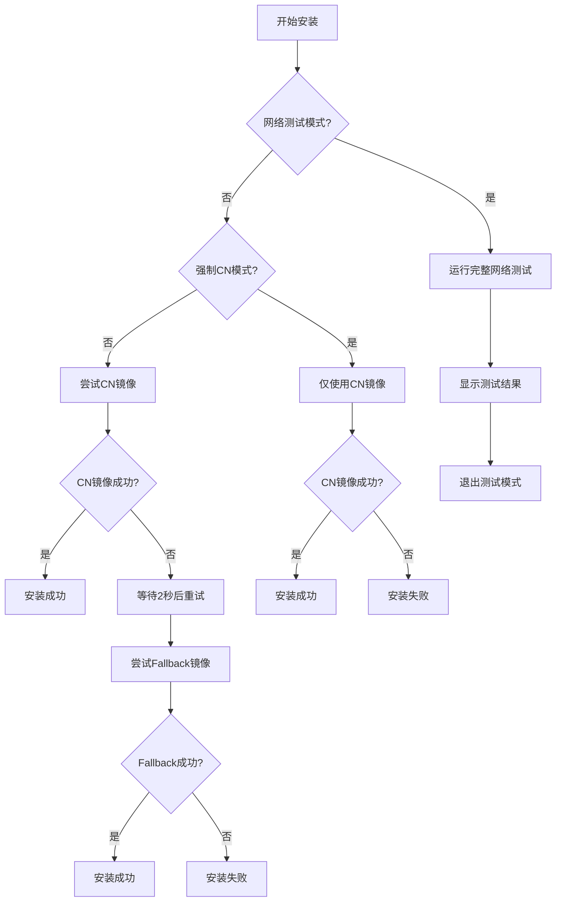

# 安装脚本网络优化与诊断指南

## 概述

本文档详细说明 `install-cn.sh` 脚本的网络优化策略、诊断方法和故障排除技巧，帮助用户在不同网络环境下获得最佳安装体验。

## 网络架构图

```
用户设备 → [网络测试] → 选择最佳镜像源 → 安装 OpenClaw
     ↓           ↓              ↓
    CN镜像     Fallback      安装成功
     ↓           ↓              ↓
   npmmirror   npmjs.org    健康检查
```

## 网络测试策略

### 1. 预安装网络测试

使用 `--network-test` 参数运行完整的网络测试：

```bash
./install-cn.sh --network-test
```

**测试内容：**
- CN 镜像可达性 (`https://registry.npmmirror.com/-/ping`)
- Fallback 镜像可达性 (`https://registry.npmjs.org/-/ping`)
- GitHub Raw 可达性 (脚本源)
- Gitee Raw 可达性 (备用源)

**输出示例：**
```
[cn-pack] Running network connectivity test...
[cn-pack] Testing CN registry: https://registry.npmmirror.com
[cn-pack] ✅ CN registry reachable
[cn-pack] Testing fallback registry: https://registry.npmjs.org
[cn-pack] ✅ Fallback registry reachable
[cn-pack] Testing script sources...
[cn-pack] ✅ GitHub raw reachable
[cn-pack] ✅ Gitee raw reachable

[cn-pack] === Network Test Summary ===
[cn-pack] ✅ Recommended: Use CN registry (https://registry.npmmirror.com)
```

### 2. 智能镜像选择逻辑



## 镜像源配置

### 默认镜像源

| 类型 | URL | 用途 | 延迟参考 |
|------|-----|------|----------|
| 主镜像 | `https://registry.npmmirror.com` | 国内用户首选 | 50-150ms |
| 回退镜像 | `https://registry.npmjs.org` | 主镜像失败时使用 | 200-500ms |

### 自定义镜像源

支持通过参数或环境变量自定义：

```bash
# 通过参数
./install-cn.sh --registry-cn https://mirrors.tencent.com/npm/ \
                --registry-fallback https://registry.npm.taobao.org

# 通过环境变量
export NPM_REGISTRY="https://mirrors.tencent.com/npm/"
export NPM_REGISTRY_FALLBACK="https://registry.npm.taobao.org"
./install-cn.sh
```

### 推荐的国内镜像源

1. **npmmirror.com** (阿里云) - 默认推荐
2. **mirrors.tencent.com/npm/** (腾讯云)
3. **registry.npm.taobao.org** (淘宝NPM)
4. **mirrors.cloud.tencent.com/npm/** (腾讯云镜像)

## 网络问题诊断

### 常见问题与解决方案

#### 问题1: CN镜像连接超时

**症状：**
```
[cn-pack] ⚠️ CN registry not reachable
```

**诊断步骤：**
```bash
# 1. 测试基础连接
curl -v https://registry.npmmirror.com/-/ping

# 2. 测试DNS解析
nslookup registry.npmmirror.com

# 3. 测试端口连通性
telnet registry.npmmirror.com 443
```

**解决方案：**
- 检查防火墙/代理设置
- 尝试其他国内镜像源
- 使用 `--force-cn` 跳过回退测试

#### 问题2: Fallback镜像也失败

**症状：**
```
[cn-pack] ❌ Both registry attempts failed.
```

**诊断步骤：**
```bash
# 1. 检查网络出口
curl -fsS https://httpbin.org/ip

# 2. 检查npm代理配置
npm config get proxy
npm config get https-proxy

# 3. 测试npm基础功能
npm ping
```

**解决方案：**
- 清除npm代理：`npm config delete proxy && npm config delete https-proxy`
- 使用系统代理：`export HTTPS_PROXY=http://127.0.0.1:7890`
- 手动安装：`npm i -g openclaw@latest`

#### 问题3: 安装成功但命令找不到

**症状：**
```
[cn-pack] Install finished but 'openclaw' not found in PATH.
```

**诊断步骤：**
```bash
# 1. 查找openclaw位置
find ~/.nvm ~/.npm -name "openclaw" -type f 2>/dev/null

# 2. 检查npm全局路径
npm bin -g

# 3. 检查PATH环境变量
echo $PATH | tr ':' '\n'
```

**解决方案：**
- 重新加载shell：`source ~/.bashrc` 或 `source ~/.zshrc`
- 添加npm全局路径到PATH
- 使用npx：`npx openclaw --version`

## 性能优化建议

### 1. 并行下载优化

对于大型依赖，可以启用并行下载：

```bash
# 设置npm并行下载数
npm config set maxsockets 10

# 设置超时时间（避免卡死）
npm config set fetch-retry-maxtimeout 60000
```

### 2. 缓存优化

```bash
# 查看npm缓存位置
npm config get cache

# 清理缓存（解决安装问题）
npm cache clean --force

# 设置缓存大小限制
npm config set cache-max 104857600  # 100MB
```

### 3. 网络超时配置

```bash
# 环境变量控制超时
export NPM_CONFIG_FETCH_TIMEOUT=30000    # 30秒
export NPM_CONFIG_FETCH_RETRIES=3        # 重试3次
```

## 高级调试模式

### 启用详细日志

```bash
# 设置npm详细日志
npm config set loglevel verbose

# 运行安装脚本
./install-cn.sh 2>&1 | tee install.log

# 或使用环境变量
NPM_CONFIG_LOGLEVEL=verbose ./install-cn.sh
```

### 网络追踪

```bash
# 使用curl详细输出
curl -v https://registry.npmmirror.com/-/ping

# 使用wget追踪
wget --debug https://registry.npmmirror.com/-/ping

# 使用tcpdump分析网络包
sudo tcpdump -i any port 443 -w npm-traffic.pcap
```

### 性能基准测试

```bash
# 测试不同镜像源的下载速度
time curl -o /dev/null -s -w "%{time_total}s\n" \
  https://registry.npmmirror.com/openclaw/latest

time curl -o /dev/null -s -w "%{time_total}s\n" \
  https://registry.npmjs.org/openclaw/latest
```

## 自动化部署集成

### CI/CD 环境配置

```yaml
# GitHub Actions 示例
jobs:
  install-openclaw:
    runs-on: ubuntu-latest
    steps:
      - uses: actions/setup-node@v3
        with:
          node-version: '20'
      
      - name: Install OpenClaw (CN optimized)
        run: |
          curl -fsSL https://clawdrepublic.cn/install-cn.sh | bash -s -- \
            --version latest \
            --registry-cn https://registry.npmmirror.com \
            --registry-fallback https://registry.npmjs.org
      
      - name: Verify installation
        run: openclaw --version
```

### Docker 环境优化

```dockerfile
# Dockerfile 示例
FROM node:20-alpine

# 设置国内镜像源
RUN npm config set registry https://registry.npmmirror.com

# 安装OpenClaw
RUN npm install -g openclaw@latest --no-audit --no-fund

# 验证安装
RUN openclaw --version

# 设置工作目录
WORKDIR /app
```

## 故障排除检查清单

### 安装前检查
- [ ] Node.js版本 >= 20 (`node -v`)
- [ ] npm可用 (`npm -v`)
- [ ] 网络连通性 (`curl -fsS https://registry.npmmirror.com`)
- [ ] 磁盘空间充足 (`df -h`)

### 安装中监控
- [ ] 镜像源选择正确
- [ ] 下载进度正常
- [ ] 无权限错误
- [ ] 无网络超时

### 安装后验证
- [ ] `openclaw --version` 输出正常
- [ ] `openclaw gateway status` 可运行
- [ ] 配置文件存在 (`~/.openclaw/openclaw.json`)
- [ ] 工作目录可访问 (`~/.openclaw/workspace`)

## 联系支持

如果遇到无法解决的问题：

1. **查看详细日志**：`./install-cn.sh 2>&1 | tee debug.log`
2. **检查网络环境**：运行 `./install-cn.sh --network-test`
3. **提交Issue**：https://github.com/1037104428/roc-ai-republic/issues
4. **论坛讨论**：https://clawdrepublic.cn/forum/

## 版本历史

| 版本 | 日期 | 更新内容 |
|------|------|----------|
| v1.0 | 2026-02-10 | 初始版本，网络优化指南 |
| v1.1 | 2026-02-10 | 添加故障排除检查清单 |

---

**提示**：定期运行 `./install-cn.sh --network-test` 监控网络状态变化，确保始终使用最佳镜像源。