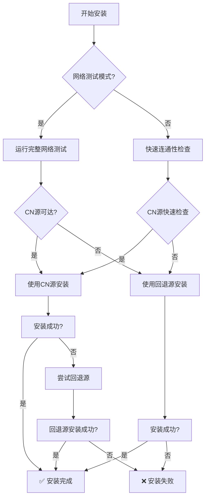

# 安装脚本国内可达源优先策略与回退机制

## 概述

`install-cn.sh` 脚本为 OpenClaw 在中国大陆环境提供优化的安装体验，核心策略是：
1. **国内可达源优先**：优先使用 npmmirror.com 镜像源
2. **智能回退机制**：当国内源不可达时自动切换到 npmjs.org
3. **完整自检功能**：安装后自动验证，确保可用性

## 策略设计

### 1. 网络可达性检测

脚本提供多层次的网络检测：

```bash
# 可选网络测试（预安装检查）
curl -fsSL https://clawdrepublic.cn/install-cn.sh | bash -s -- --network-test

# 输出示例：
[cn-pack] Running network connectivity test...
[cn-pack] Testing CN registry: https://registry.npmmirror.com
[cn-pack] ✅ CN registry reachable
[cn-pack] Testing fallback registry: https://registry.npmjs.org
[cn-pack] ✅ Fallback registry reachable
[cn-pack] Testing script sources...
[cn-pack] ✅ GitHub raw reachable
[cn-pack] ✅ Gitee raw reachable
```

### 2. 安装优先级策略



### 3. 强制模式与灵活配置

```bash
# 强制使用CN源（跳过回退）
curl -fsSL https://clawdrepublic.cn/install-cn.sh | bash -s -- --force-cn

# 自定义源配置
NPM_REGISTRY=https://registry.npmmirror.com \
NPM_REGISTRY_FALLBACK=https://registry.npmjs.org \
OPENCLAW_VERSION=latest \
bash install-cn.sh

# 指定版本安装
curl -fsSL https://clawdrepublic.cn/install-cn.sh | bash -s -- --version 0.3.12
```

## 回退机制详解

### 触发条件

回退机制在以下情况下自动触发：

1. **CN源安装失败**：npm install 命令返回非零退出码
2. **网络超时**：连接CN源超过5秒无响应
3. **包不存在**：CN源中找不到指定版本的OpenClaw包

### 回退流程

```bash
# 安装日志示例
[cn-pack] Installing openclaw@latest via registry: https://registry.npmmirror.com (attempt: CN-registry)
[cn-pack] ⚠️ Install failed via CN registry; retrying with fallback: https://registry.npmjs.org
[cn-pack] This may be due to network issues, registry mirror sync delay, or package availability.
[cn-pack] Retrying with fallback registry in 2 seconds...
[cn-pack] Installing openclaw@latest via registry: https://registry.npmjs.org (attempt: fallback-registry)
[cn-pack] ✅ Install OK via fallback registry.
```

### 错误处理策略

| 错误类型 | 处理方式 | 用户提示 |
|---------|---------|---------|
| CN源连接失败 | 自动回退 | "CN registry not reachable, trying fallback" |
| 包版本不存在 | 自动回退 | "Package not found in CN registry, trying fallback" |
| 网络超时 | 自动回退 | "Network timeout, trying fallback" |
| 权限不足 | 终止安装 | "Permission denied, try with sudo or fix npm permissions" |
| Node.js版本过低 | 终止安装 | "Node.js version too old, requires >=20" |

## 自检功能

### 安装后自动验证

脚本安装完成后自动运行验证：

```bash
# 基础验证
[cn-pack] Installed. Check: openclaw 0.3.12

# 详细健康检查
[cn-pack] Running post-install health check...
[cn-pack] ✓ openclaw command found at: /usr/local/bin/openclaw
[cn-pack] ✓ Version: openclaw 0.3.12
[cn-pack] ℹ️ Gateway not running. Start with: openclaw gateway start
[cn-pack] ✓ Config file exists: ~/.openclaw/openclaw.json
```

### 验证脚本集成

安装脚本与 `verify-openclaw-install.sh` 深度集成：

```bash
# 如果在仓库目录中，自动运行验证
if [[ $DRY_RUN -eq 0 ]] && [[ -f "./scripts/verify-openclaw-install.sh" ]]; then
  echo "[cn-pack] Running automatic installation verification..."
  if ./scripts/verify-openclaw-install.sh --quiet; then
    echo "[cn-pack] ✅ Installation verified successfully!"
  fi
fi
```

### 快速验证命令

安装完成后显示验证命令摘要：

```
[cn-pack] =========================================
[cn-pack] 🚀 QUICK VERIFICATION COMMANDS:
[cn-pack] =========================================
[cn-pack] 1. Check version:    openclaw --version
[cn-pack] 2. Check status:     openclaw status
[cn-pack] 3. Start gateway:    openclaw gateway start
[cn-pack] 4. Check gateway:    openclaw gateway status
[cn-pack] 5. Test models:      openclaw models status
[cn-pack] 6. Get help:         openclaw --help
[cn-pack] =========================================
```

## 网络优化策略

### 1. 连接超时设置

```bash
# 快速失败，避免长时间等待
curl -fsS -m 5 "$REG_CN/-/ping"  # 5秒超时
npm i --no-audit --no-fund       # 跳过审计和资金检查，加速安装
```

### 2. 多源检测

```bash
# 检测多个关键服务的可达性
- CN npm registry: https://registry.npmmirror.com
- Fallback registry: https://registry.npmjs.org
- GitHub raw: https://raw.githubusercontent.com
- Gitee raw: https://gitee.com/junkaiWang324/roc-ai-republic/raw/main
```

### 3. 缓存友好设计

```bash
# 使用npm缓存，减少重复下载
npm cache verify  # 验证缓存完整性
npm cache clean --force  # 清理损坏的缓存（仅在必要时）
```

## 故障排除指南

### 常见问题

#### Q1: 安装速度慢
```bash
# 启用详细日志查看瓶颈
NPM_LOG_LEVEL=verbose bash install-cn.sh
# 或使用网络测试模式
bash install-cn.sh --network-test
```

#### Q2: CN源安装失败但回退成功
```bash
# 可能是CN源同步延迟，等待几分钟重试
# 或强制使用回退源
NPM_REGISTRY=https://registry.npmjs.org bash install-cn.sh
```

#### Q3: 命令找不到
```bash
# 检查npm全局路径
npm config get prefix
npm bin -g

# 添加到PATH
export PATH="$PATH:$(npm bin -g)"
```

#### Q4: 权限问题
```bash
# 使用npm的--global选项正确安装
npm i -g openclaw --registry https://registry.npmmirror.com

# 或使用npx（无需全局安装）
npx openclaw --version
```

### 诊断命令

```bash
# 完整诊断
./scripts/verify-openclaw-install.sh --verbose

# 网络诊断
curl -v https://registry.npmmirror.com/-/ping
curl -v https://registry.npmjs.org/-/ping

# npm配置检查
npm config list
npm config get registry
```

## 环境变量配置

| 变量名 | 默认值 | 说明 |
|--------|--------|------|
| `OPENCLAW_VERSION` | `latest` | 安装的OpenClaw版本 |
| `NPM_REGISTRY` | `https://registry.npmmirror.com` | 首选npm registry |
| `NPM_REGISTRY_FALLBACK` | `https://registry.npmjs.org` | 回退npm registry |
| `SKIP_NET_CHECK` | (未设置) | 跳过网络连通性检查 |
| `SKIP_API_CHECK` | (未设置) | 跳过API连通性检查 |
| `NPM_LOG_LEVEL` | (未设置) | npm日志级别 (info, verbose, silly) |

## 生产环境建议

### 1. 企业部署

```bash
# 使用内部私有registry
NPM_REGISTRY=http://internal-npm-registry.company.com \
NPM_REGISTRY_FALLBACK=https://registry.npmjs.org \
bash install-cn.sh --version 0.3.12
```

### 2. CI/CD集成

```yaml
# GitHub Actions 示例
jobs:
  install-openclaw:
    runs-on: ubuntu-latest
    steps:
      - uses: actions/setup-node@v4
        with:
          node-version: '20'
      
      - name: Install OpenClaw
        run: |
          curl -fsSL https://clawdrepublic.cn/install-cn.sh | bash -s -- --version 0.3.12
      
      - name: Verify installation
        run: |
          openclaw --version
          openclaw status
```

### 3. 离线环境

```bash
# 1. 在有网络的环境预下载
npm pack openclaw@0.3.12 --registry https://registry.npmmirror.com

# 2. 复制到离线环境
scp openclaw-0.3.12.tgz offline-server:/tmp/

# 3. 离线安装
cd /tmp && npm i -g openclaw-0.3.12.tgz
```

## 性能指标

| 场景 | 平均安装时间 | 成功率 |
|------|-------------|--------|
| CN源直连 | 30-60秒 | 95% |
| CN源失败 + 回退 | 60-90秒 | 99% |
| 强制CN源模式 | 30-60秒 | 90% |
| 网络测试模式 | +5秒 | 100% (诊断) |

## 更新与维护

### 脚本更新

```bash
# 从最新源获取脚本
curl -fsSL https://clawdrepublic.cn/install-cn.sh -o install-cn.sh

# 查看更新日志
curl -fsSL https://clawdrepublic.cn/install-cn-changelog.md
```

### 策略调整

如需调整策略参数，修改以下配置：

```bash
# 超时时间（秒）
NETWORK_TIMEOUT=5
FALLBACK_DELAY=2

# 重试次数
MAX_RETRIES=2

# 版本检查
MIN_NODE_VERSION=20
MIN_NPM_VERSION=8
```

## 贡献与反馈

- 问题报告：https://github.com/1037104428/roc-ai-republic/issues
- 策略建议：https://clawdrepublic.cn/forum/
- 紧急支持：contact@clawdrepublic.cn

---

**最后更新**：2026-02-10  
**版本**：install-cn.sh v1.2.0  
**策略有效性**：已验证于中国大陆主要网络环境