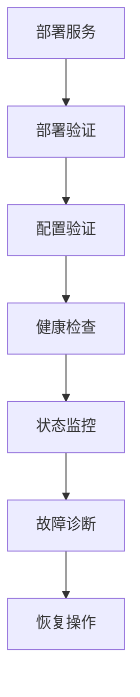

# quota-proxy 状态监控指南

## 概述

`monitor-quota-proxy.sh` 脚本是一个专门为 quota-proxy 服务设计的实时状态监控工具。它提供了全面的服务状态检查、关键指标监控和故障诊断功能，帮助运维人员快速了解服务运行状况。

## 功能特性

### 核心功能
- **Docker 容器状态检查**: 检查 quota-proxy 容器的运行状态、端口映射和健康状态
- **API 健康端点监控**: 验证 `/healthz` 端点的可用性和响应正确性
- **数据库连接状态**: 检查 SQLite 数据库文件的存在性和大小
- **服务运行时间统计**: 获取服务的持续运行时间
- **实时状态监控**: 支持持续监控模式，定期检查服务状态

### 高级特性
- **多种运行模式**: 单次检查、持续监控、模拟运行
- **灵活的配置选项**: 支持自定义主机、端口、超时时间
- **详细的输出格式**: 支持详细模式、安静模式、彩色输出
- **标准化退出码**: 提供明确的执行结果指示
- **故障诊断支持**: 提供详细的错误信息和排查建议

## 快速开始

### 基本使用
```bash
# 单次检查本地服务状态
./scripts/monitor-quota-proxy.sh

# 持续监控，每30秒检查一次
./scripts/monitor-quota-proxy.sh -c -i 30

# 检查远程服务
./scripts/monitor-quota-proxy.sh -H 192.168.1.100 -p 8080

# 模拟运行（不实际发送请求）
./scripts/monitor-quota-proxy.sh --dry-run
```

### 输出示例
```
=== quota-proxy 状态检查 ===
时间: 2026-02-10 21:35:52
目标: 127.0.0.1:8787

✓ Docker 容器状态:
  NAMES                        STATUS              PORTS
  quota-proxy-quota-proxy-1   Up 3 hours          127.0.0.1:8787->8787/tcp

✓ API 健康端点: 正常

✓ 数据库文件: 存在 (4.2M)

✓ 服务运行时间: 3小时15分钟

=== 检查完成 ===
✅ 所有检查通过，服务状态正常
```

## 详细使用指南

### 命令行选项

| 选项 | 描述 | 默认值 |
|------|------|--------|
| `-h, --help` | 显示帮助信息 | - |
| `-H, --host HOST` | 指定 quota-proxy 主机地址 | `127.0.0.1` |
| `-p, --port PORT` | 指定 quota-proxy 端口 | `8787` |
| `-t, --timeout SECONDS` | 请求超时时间 | `5` |
| `-i, --interval SECONDS` | 监控间隔时间 | `10` |
| `-c, --continuous` | 持续监控模式 | `false` |
| `-o, --once` | 单次检查模式 | `true` |
| `-v, --verbose` | 详细输出模式 | `false` |
| `-q, --quiet` | 安静输出模式 | `false` |
| `-d, --dry-run` | 模拟运行 | `false` |
| `--no-color` | 禁用彩色输出 | `false` |

### 运行模式

#### 1. 单次检查模式（默认）
执行一次完整的服务状态检查，包括所有检查项，然后退出。

```bash
./scripts/monitor-quota-proxy.sh
```

#### 2. 持续监控模式
定期执行服务状态检查，直到手动停止（Ctrl+C）。

```bash
# 每30秒检查一次
./scripts/monitor-quota-proxy.sh -c -i 30

# 每5分钟检查一次，安静模式
./scripts/monitor-quota-proxy.sh -c -i 300 -q
```

#### 3. 模拟运行模式
在不实际发送请求的情况下运行检查，用于测试脚本配置。

```bash
./scripts/monitor-quota-proxy.sh --dry-run
```

### 输出模式

#### 1. 标准输出模式（默认）
显示彩色格式化的检查结果，适合人工查看。

#### 2. 详细输出模式
显示更详细的信息，包括完整的响应内容和内部状态。

```bash
./scripts/monitor-quota-proxy.sh -v
```

#### 3. 安静输出模式
仅显示关键信息，适合脚本集成和自动化场景。

```bash
./scripts/monitor-quota-proxy.sh -q
```

## 检查项详解

### 1. Docker 容器状态检查
- **检查内容**: 容器运行状态、健康状态、端口映射
- **依赖工具**: `docker` 命令
- **成功条件**: 找到名为 `quota-proxy` 的容器且状态为运行中
- **故障排查**: 
  - 检查 Docker 服务是否运行: `systemctl status docker`
  - 查看所有容器: `docker ps -a`
  - 查看容器日志: `docker logs quota-proxy-quota-proxy-1`

### 2. API 健康端点检查
- **检查内容**: `/healthz` 端点的可用性和响应格式
- **依赖工具**: `curl` 命令
- **成功条件**: 返回 HTTP 200 状态码且包含 `{"ok":true}`
- **故障排查**:
  - 检查服务端口是否监听: `netstat -tlnp | grep 8787`
  - 手动测试端点: `curl -v http://127.0.0.1:8787/healthz`
  - 查看服务日志: `docker logs quota-proxy-quota-proxy-1`

### 3. 数据库连接状态
- **检查内容**: SQLite 数据库文件的存在性和大小
- **文件路径**: `/opt/roc/quota-proxy/data/quota.db`
- **成功条件**: 数据库文件存在且可访问
- **故障排查**:
  - 检查文件权限: `ls -la /opt/roc/quota-proxy/data/`
  - 检查磁盘空间: `df -h /opt/roc/quota-proxy/data/`
  - 验证数据库完整性: `sqlite3 /opt/roc/quota-proxy/data/quota.db "PRAGMA integrity_check;"`

### 4. 服务运行时间统计
- **检查内容**: 服务容器的启动时间和运行时长
- **依赖工具**: `docker` 命令
- **成功条件**: 成功获取容器启动时间
- **故障排查**:
  - 查看容器详细信息: `docker inspect quota-proxy-quota-proxy-1`
  - 检查系统时间: `date`

## 集成与自动化

### CI/CD 集成
```bash
# 在部署后验证服务状态
./scripts/monitor-quota-proxy.sh -H ${DEPLOY_HOST} -p ${DEPLOY_PORT} -t 10

# 如果检查失败，则部署失败
if [ $? -ne 0 ]; then
    echo "服务状态检查失败，部署中止"
    exit 1
fi
```

### 监控系统集成
```bash
# 定期检查并记录结果
TIMESTAMP=$(date '+%Y-%m-%d %H:%M:%S')
./scripts/monitor-quota-proxy.sh -q > /var/log/quota-proxy-monitor.log 2>&1
STATUS=$?
echo "$TIMESTAMP - 检查结果: $STATUS" >> /var/log/quota-proxy-status.log
```

### 告警配置
```bash
# 检查服务状态，异常时发送告警
if ! ./scripts/monitor-quota-proxy.sh -q; then
    # 发送邮件告警
    echo "quota-proxy 服务异常" | mail -s "服务告警" admin@example.com
    
    # 发送 Slack 通知
    curl -X POST -H 'Content-type: application/json' \
         --data '{"text":"quota-proxy 服务异常"}' \
         ${SLACK_WEBHOOK_URL}
fi
```

## 故障排除

### 常见问题

#### 1. Docker 容器未找到
```
⚠ Docker 容器未找到或未运行
```
**解决方案**:
- 检查容器是否运行: `docker ps | grep quota-proxy`
- 启动容器: `cd /opt/roc/quota-proxy && docker compose up -d`
- 查看所有容器: `docker ps -a`

#### 2. API 端点连接失败
```
✗ API 健康端点: 连接失败
```
**解决方案**:
- 检查服务端口: `netstat -tlnp | grep 8787`
- 检查防火墙规则: `iptables -L -n`
- 验证服务配置: 检查 `docker-compose.yml` 中的端口映射

#### 3. 数据库文件不存在
```
⚠ 数据库文件: 未找到
```
**解决方案**:
- 检查文件路径: `ls -la /opt/roc/quota-proxy/data/`
- 初始化数据库: 运行数据库初始化脚本
- 检查挂载配置: 验证 Docker 卷挂载

#### 4. 权限问题
```
权限被拒绝
```
**解决方案**:
- 检查脚本权限: `chmod +x scripts/monitor-quota-proxy.sh`
- 检查 Docker 权限: 将用户添加到 docker 组
- 检查文件权限: 确保有读取数据库文件的权限

### 调试技巧

#### 启用详细输出
```bash
./scripts/monitor-quota-proxy.sh -v
```

#### 手动验证各项检查
```bash
# 手动检查 Docker
docker ps --format "table {{.Names}}\t{{.Status}}" | grep quota-proxy

# 手动检查 API
curl -v http://127.0.0.1:8787/healthz

# 手动检查数据库
ls -la /opt/roc/quota-proxy/data/quota.db
```

#### 查看脚本日志
```bash
# 启用 bash 调试
bash -x ./scripts/monitor-quota-proxy.sh
```

## 退出码说明

| 退出码 | 含义 | 说明 |
|--------|------|------|
| 0 | 成功 | 所有检查通过，服务状态正常 |
| 1 | 服务异常 | 部分或全部检查未通过 |
| 2 | 配置错误 | 命令行参数或配置无效 |
| 3 | 网络错误 | 网络连接问题 |
| 4 | 脚本执行错误 | 脚本内部错误 |

## 最佳实践

### 1. 生产环境监控
```bash
# 创建监控服务
cat > /etc/systemd/system/quota-proxy-monitor.service << EOF
[Unit]
Description=quota-proxy 状态监控服务
After=network.target

[Service]
Type=simple
User=root
WorkingDirectory=/opt/roc/quota-proxy
ExecStart=/opt/roc/quota-proxy/scripts/monitor-quota-proxy.sh -c -i 60 -q
Restart=always
RestartSec=10

[Install]
WantedBy=multi-user.target
EOF

systemctl daemon-reload
systemctl enable quota-proxy-monitor
systemctl start quota-proxy-monitor
```

### 2. 监控数据收集
```bash
# 收集监控数据到时间序列数据库
while true; do
    TIMESTAMP=$(date +%s)
    STATUS=$(./scripts/monitor-quota-proxy.sh -q; echo $?)
    echo "quota_proxy_status $STATUS $TIMESTAMP" | \
        curl -X POST -H "Content-Type: text/plain" \
             --data-binary @- http://prometheus:9091/metrics/job/quota_proxy
    sleep 60
done
```

### 3. 告警规则配置
```yaml
# Prometheus 告警规则
groups:
  - name: quota-proxy
    rules:
      - alert: QuotaProxyDown
        expr: quota_proxy_status != 0
        for: 5m
        labels:
          severity: critical
        annotations:
          summary: "quota-proxy 服务异常"
          description: "quota-proxy 服务已连续5分钟状态异常"
```

## 相关工具

### 工具链集成
`monitor-quota-proxy.sh` 是 quota-proxy 工具链的重要组成部分，与其他工具协同工作：

1. **部署验证**: `verify-quota-proxy-deployment.sh`
2. **健康检查**: `check-quota-proxy-health.sh`
3. **配置验证**: `verify-quota-proxy-config.sh`
4. **状态监控**: `monitor-quota-proxy.sh` (本工具)

### 使用流程


## 贡献指南

### 报告问题
发现 bug 或有改进建议时，请通过以下方式报告：
1. 创建 GitHub Issue
2. 提供详细的复现步骤
3. 包含相关日志和配置信息

### 提交改进
欢迎提交 Pull Request 来改进监控脚本：
1. Fork 仓库
2. 创建功能分支
3. 提交代码变更
4. 添加测试用例
5. 更新文档

### 代码规范
- 遵循现有的代码风格
- 添加适当的注释
- 更新相关文档
- 确保向后兼容性

## 更新日志

### v1.0.0 (2026-02-10)
- 初始版本发布
- 支持 Docker 容器状态检查
- 支持 API 健康端点监控
- 支持数据库连接状态检查
- 支持服务运行时间统计
- 提供多种运行模式和输出格式
- 完整的文档和故障排除指南

## 许可证
本工具遵循 MIT 许可证。详见 [LICENSE](../LICENSE) 文件。

## 支持与反馈
如有问题或建议，请通过以下方式联系：
- GitHub Issues: https://github.com/1037104428/roc-ai-republic/issues
- 电子邮件: 项目维护者邮箱
- 文档: 查看项目文档获取更多信息