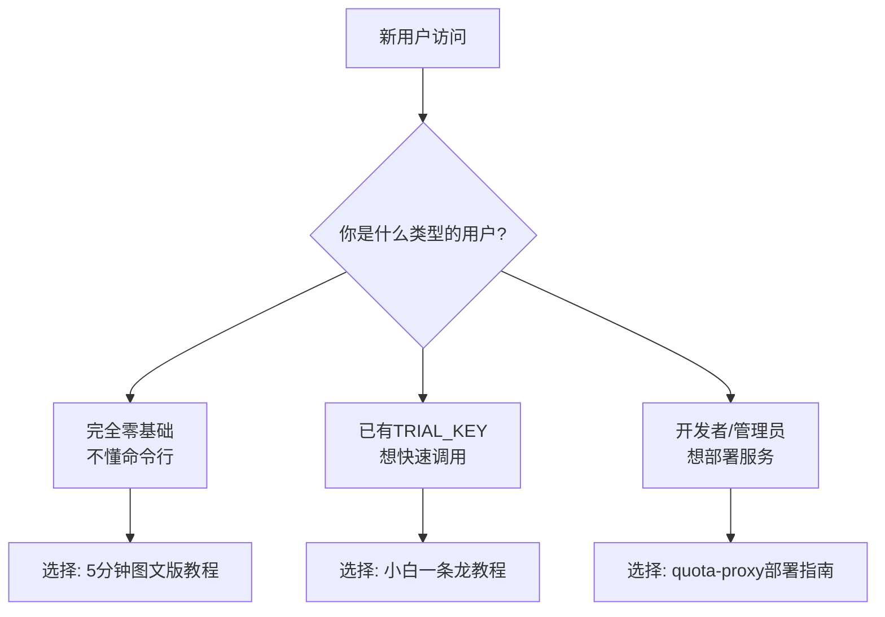
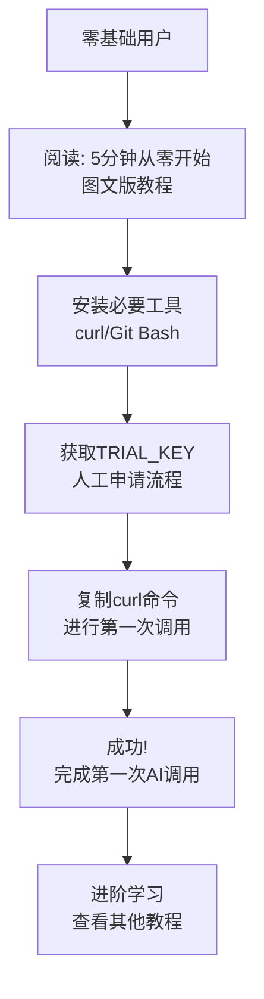
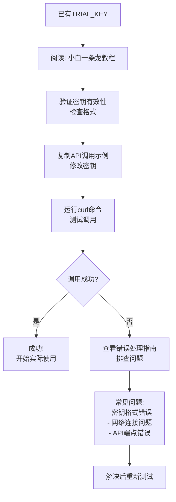
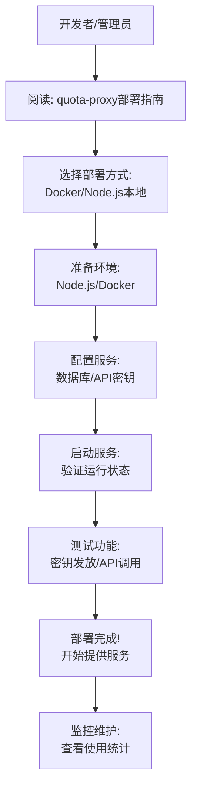

# Clawd 国度学习路径流程图

## 🎯 用户类型识别

## 🚀 零基础用户路径

## 🔑 已有密钥用户路径

## 🛠️ 开发者/管理员路径

## 📊 时间预估

| 用户类型 | 教程选择 | 预计时间 | 完成目标 |
|---------|----------|----------|----------|
| 零基础 | 5分钟图文版 | 5-10分钟 | 完成第一次API调用 |
| 已有密钥 | 小白一条龙 | 2-3分钟 | 验证密钥并调用API |
| 开发者 | quota-proxy部署 | 15-30分钟 | 部署完整服务环境 |

## 🔗 下一步建议

完成基础教程后，建议：

1. **探索更多API功能** - 查看API文档，了解所有可用功能
2. **加入社区** - 访问论坛，与其他用户交流
3. **贡献代码** - 参与项目开发，提交PR
4. **分享经验** - 在论坛分享使用心得

## ❓ 遇到问题怎么办？

1. **查看教程FAQ** - 每个教程都有常见问题解答
2. **搜索论坛** - 可能已经有类似问题的解决方案
3. **发帖提问** - 在论坛"问题反馈"板块发帖
4. **联系管理员** - 紧急问题可联系管理员

---

**最后更新**: 2026-02-11  
**设计理念**: 让每个用户都能找到最适合自己的学习路径，快速上手Clawd国度服务。